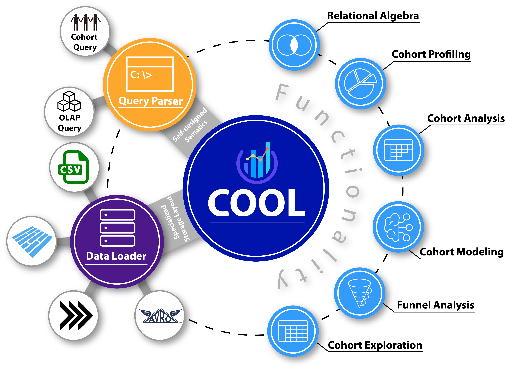

# COOL: a COhort OnLine analytical processing system

---

[Website](https://www.comp.nus.edu.sg/~dbsystem/cool/#/) | [Documentation](https://www.comp.nus.edu.sg/~dbsystem/cool/docs/getting-started/quickstart) | [Blog](https://www.comp.nus.edu.sg/~dbsystem/cool/blog) | [Demo](http://13.212.99.209:8201/) | [GitHub](https://github.com/COOL-cohort/COOL)

---


## Introduction to COOL



Different groups of people often have different behaviors or trends. For example, the bones of older people are more porous than those of younger people. It is of great value to explore the behaviors and trends of different groups of people, especially in healthcare, because we could adopt appropriate measures in time to avoid tragedy. The easiest way to do this is **cohort analysis**.

But with a variety of big data accumulated over the years, **query efficiency** becomes one of the problems that OnLine Analytical Processing (OLAP) systems meet, especially for cohort analysis. Therefore, COOL is introduced to solve the problems.

COOL is an online cohort analytical processing system that supports various types of data analytics, including cube query, iceberg query and cohort query.

With the support of several newly proposed operators on top of a sophisticated storage layer, COOL could provide high performance (near real-time) analytical response for emerging data warehouse domains.


## Key features of COOL

1. **Easy to use.** COOL is easy to deploy on local or on cloud via docker.
2. **Near Real-time Responses.** COOL is highly efficient, and therefore, can process cohort queries in near real-time analytical responses.
3. **Specialized Storage Layout.** A specialized storage layout is designed for fast query processing and reduced space consumption.
4. **Self-designed Semantics.** There are some novel self-designed semantics for the cohort query, which can simplify its complexity and improve its functionality.
5. **Flexible Integration.** Flexible integration with other data systems via common data formats(e.g., CSV, Parquet, Avro, and Arrow).
6. **Artificial Intelligence Model.** A new neural network model will be introduced soon.

## Quickstart

### BUILD

Simply run `mvn clean package`

### Required sources:

1. **dataset file**: a csv file with "," delimiter (normally dumped from a database table), and the table header is removed.
3. **dataset schema file**: a `table.yaml` file specifying the dataset's columns and their measure fields.
4. **query file**: a yaml file specify the parameters for running query server.

### Load dataset

Before query processing, we need to load the dataset into COOL native format. The sample code to load csv dataset with data loader can be found in [CsvLoader.java](cool-core/src/main/java/com/nus/cool/functionality/CsvLoader.java).

```bash
$ java -cp ./cool-core/target/cool-core-0.1-SNAPSHOT.jar com.nus.cool.functionality.CsvLoader path/to/your/source/directory path/to/your/.yaml path/to/your/datafile path/to/output/datasource/directory
```

The five arguments in the command have the following meaning:
1. a unique dataset name given under the directory
2. the table.yaml (the third required source)
3. the dataset file (the first required source)
4. the output directory for the compacted dataset


### Execute queries

We provide an example for cohort query processing in [CohortAnalysis.java](cool-core/src/main/java/com/nus/cool/functionality/CohortAnalysis.java).

There are two types of queries in COOL. The first one includes two steps.

#### Cohort Query

- Select the specific users.

```bash
$ java -cp ./cool-core/target/cool-core-0.1-SNAPSHOT.jar com.nus.cool.functionality.CohortSelection path/to/output/datasource/directory path/to/your/queryfile
```

- Executes cohort query users.

```bash
$ java -cp ./cool-core/target/cool-core-0.1-SNAPSHOT.jar com.nus.cool.functionality.CohortAnalysis path/to/output/datasource/directory path/to/your/cohortqueryfile
```

- Executes the funnel query.

```bash
$ java -cp ./cool-core/target/cool-core-0.1-SNAPSHOT.jar com.nus.cool.functionality.FunnelAnalysis path/to/output/datasource/directory path/to/your/funnelqueryfile
```

#### OLAP Query

- Executes the following query in cool.

```bash
$ java -cp ./cool-core/target/cool-core-0.1-SNAPSHOT.jar com.nus.cool.functionality.IcebergLoader path/to/output/datasource/directory path/to/your/queryfile
```

### Example-Cohort Analysis

#### Load dataset

We have provided examples in `sogamo` directory and `health` directory. Now we take `sogamo` for example.

The COOL system supports CSV data format by default, and you can load `sogamo` dataset with the following command.

```bash
$ java -cp ./cool-core/target/cool-core-0.1-SNAPSHOT.jar com.nus.cool.functionality.CsvLoader sogamo sogamo/table.yaml sogamo/data.csv CubeRepo
```

In addition, you can run the following command to load dataset in other formats under the `sogamo` directory.

- parquet format data
```bash
$ java -jar cool-extensions/parquet-extensions/target/parquet-extensions-0.1-SNAPSHOT.jar sogamo sogamo/table.yaml sogamo/data.parquet CubeRepo
```

- Arrow format data
```bash
$ java -jar cool-extensions/arrow-extensions/target/arrow-extensions-0.1-SNAPSHOT.jar sogamo sogamo/table.yaml sogamo/data.arrow CubeRepo
```

- Avro format data
```bash
$ java -jar cool-extensions/avro-extensions/target/avro-extensions-0.1-SNAPSHOT.jar sogamo sogamo/table.yaml sogamo/avro/test.avro CubeRepo sogamo/avro/schema.avsc
```

Finally, there will be a cube generated under the `CubeRepo` directory, which is named `sogamo`.

#### Execute queries

We use the `health` dataset for example to demonstrate the cohort ananlysis.

- Select the specific users.

```bash
$ java -cp ./cool-core/target/cool-core-0.1-SNAPSHOT.jar com.nus.cool.functionality.CohortSelection CubeRepo health/query1-0.json
```

where the three arguments are as follows:
1. `CubeRepo`: the output directory for the compacted dataset
2. `health`: the cube name of the compacted dataset
3. `health/query1-0.json`: the json file for the cohort query

- Display the selected all records of the cohort in terminal for exploration
```
$ java -cp ./cool-core/target/cool-core-0.1-SNAPSHOT.jar com.nus.cool.functionality.CohortExploration CubeRepo health loyal
```

- Execute cohort query on the selected users.

```bash
$ java -cp ./cool-core/target/cool-core-0.1-SNAPSHOT.jar com.nus.cool.functionality.CohortAnalysis CubeRepo health/query1-1.json
```

- Execute cohort query on all the users.

```bash
$ java -cp ./cool-core/target/cool-core-0.1-SNAPSHOT.jar com.nus.cool.functionality.CohortAnalysis CubeRepo health/query2.json
```

Partial results for the query `health/query2.json` on the `health` dataset are as at [result2.json](health/result2.json)

We use the `sogamo` dataset for example to demonstrate the funnel analysis.

```bash
$ java -cp ./cool-core/target/cool-core-0.1-SNAPSHOT.jar com.nus.cool.functionality.FunnelAnalysis CubeRepo sogamo/query1.json
```

### Example-OLAP Analysis

#### Load dataset

We have provided examples in `olap-tpch` directory.

The COOL system supports CSV data format by default, and you can load `tpc-h` dataset with the following command.

```bash
java -cp ./cool-core/target/cool-core-0.1-SNAPSHOT.jar com.nus.cool.functionality.CsvLoader tpc-h-10g olap-tpch/table.yaml olap-tpch/scripts/data.csv CubeRepo
```

Finally, there will be a cube generated under the `CubeRepo` directory, which is named `tpc-h-10g`.

#### Execute queries
Run Server

1. put the `application.property file at the same level as the .jar file.
2. edit the server configuration in the `application.property file.
3. run the below commond line.
```
java -jar cool-queryserver/target/cool-queryserver-0.1-SNAPSHOT.jar
```

## CONNECT TO EXTERNAL STORAGE SERVICES
COOL has an [StorageService](cool-core/src/main/java/com/nus/cool/storageservice/StorageService.java) interface, which will allow COOL standalone server/workers (coming soon) to handle data movement between local and an external storage service. A sample implementation for HDFS connection can be found under the [hdfs-extensions](cool-extensions/hdfs-extensions/).


## Publication
* Q. Cai, K. Zheng, H.V. Jagadish, B.C. Ooi, J.W.L. Yip. CohortNet: Empowering Cohort Discovery for Interpretable Healthcare Analytics, in Proceedings of the VLDB Endowment, 10(17), 2024.
* Z. Xie, H. Ying, C. Yue, M. Zhang, G. Chen, B. C. Ooi. [Cool: a COhort OnLine analytical processing system](https://www.comp.nus.edu.sg/~ooibc/icde20cool.pdf), in 2020 IEEE 36th International Conference on Data Engineering, pp.577-588, 2020.
* Q. Cai, Z. Xie, M. Zhang, G. Chen, H.V. Jagadish and B.C. Ooi. [Effective Temporal Dependence Discovery in Time Series Data](http://www.comp.nus.edu.sg/~ooibc/cohana18.pdf), in Proceedings of the VLDB Endowment, 11(8), pp.893-905, 2018.
* Z. Xie, Q. Cai, F. He, G.Y. Ooi, W. Huang, B.C. Ooi. [Cohort Analysis with Ease](https://dl.acm.org/doi/10.1145/3183713.3193540), in Proceedings of the 2018 International Conference on Management of Data, pp.1737-1740, 2018.
* D. Jiang, Q. Cai, G. Chen, H. V. Jagadish, B. C. Ooi, K.-L. Tan, and A. K. H. Tung. [Cohort Query Processing](http://www.vldb.org/pvldb/vol10/p1-ooi.pdf), in Proceedings of the VLDB Endowment, 10(1), 2016.
