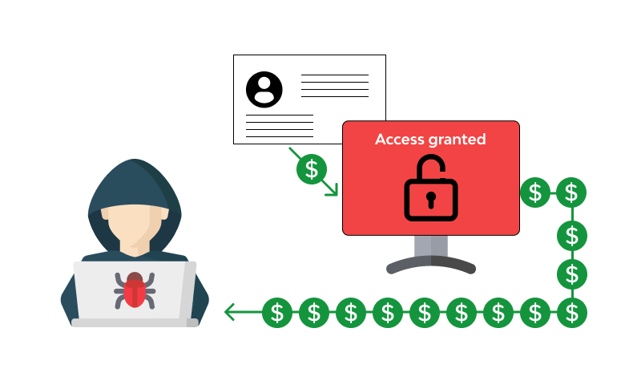

## Introduction to COOL

### Background:

User’s account may be taken over by some cyber attackers. To save time and resource, one attacker may steal more than one account within a short time. We can find such stolen accounts by analysing their actions.

### User selection:

Normal accounts seldom change the password. If a group of users who update password using the same IP in the same day, they can be treated as a cohort. It is likely that the accounts may be stolen by the same hackers.

### Birth Criteria:

Users who have update password using the same IP in the same day with others. Group by: IP + action date

### Cohort Matrix:

1. **Login IP** : the attackers usually use VPN to hide the real IP information. For the ATO victims, the number of login IP after the cohort birthday may increase a lot. There may
be some new IP address which are never been used by this account.
2. **Login device.** normal accounts seldom share device_id with others. If one account is
in a suspicious cohort, and the shared device_id increase, we can treat it as an ATO case. There may be multiple new device logging this accounts within a short time- span.
### Age Definition: 
Time: in day.

The sample data is stored in "fraud_samples_small.csv" and the output cohort generated from the python script is in "cohort.csv".
A bigger dataset can be found in https://nusu-my.sharepoint.com/:x:/r/personal/e0427819_u_nus_edu/Documents/ecommerce_use_case/fraud_samples.csv?d=w2c3e11188da74b93a1bfef5c296d2fc2&csf=1&web=1&e=hySS5W